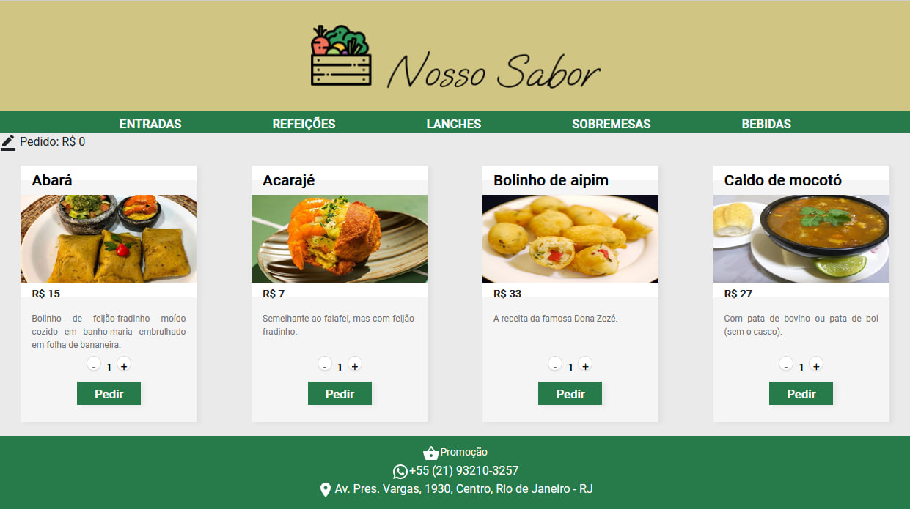

# MVP 2 - Desenvolvimento Front-end Avançado

## PUC-Rio Digital - Desenvolvimento em Full Stack (2023)

Coordenação: [Marcos Kalinowski](kalinowski@inf.puc-rio.br).

Professores: [Fernando Correia](fernando.correia.jr@gmail.com), [Dieinison Braga](dieinisonbraga@gmail.com) e [Marisa Silva](https://github.com/marisa-ec).

Aluno: [Gabriel dos Santos Reis](https://github.com/gaelsreis).

---

## Front-End

O Produto Mínimo Viável / *Minimum Viable Product (MVP)* envolve utilizar componentização com React e seus recursos como hooks, props e states, bem como simular chamadas a um servidor fazendo a leitura de um JSON. Foram utilizados HTML, CSS, JavaScript, Node.js e React.js.

### Figma

Projeto: [PUC-Rio Sprint 2](https://www.figma.com/file/OUsg8AjQywAL3FAqtzyDdT/PUC-Rio-Sprint-2). Protótipo em alta-fidelidade de 3 páginas interativas.

---

### Instruções

Baixe e instale o ambiente de execução assíncrono e interpretador de JavaScript [Node.js](https://nodejs.org/en/download/). Instale as dependências/bibliotecas descritas no arquivo package.json utilizando o Node Package Manager (NPM), usando os comandos no terminal, no diretório front/:

~~~PowerShell
## Instalação do NPM. A pasta node_modules será criada.
$ npm install

## Iniciação do NPM
$ npm start
~~~

Parar o NPM, pelo atalho de teclado, no VS Code:
> Ctrl + C
